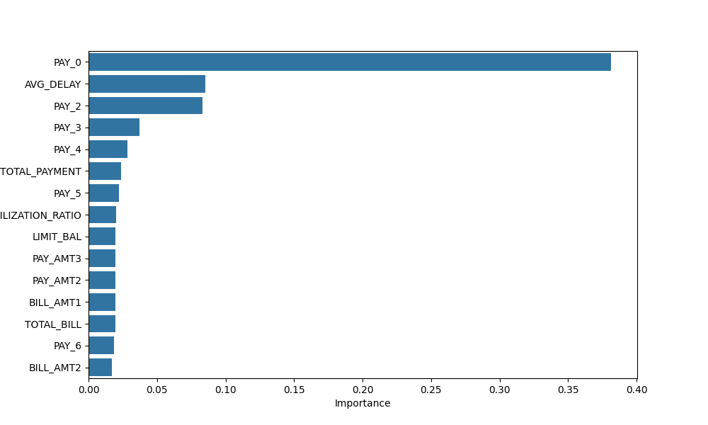
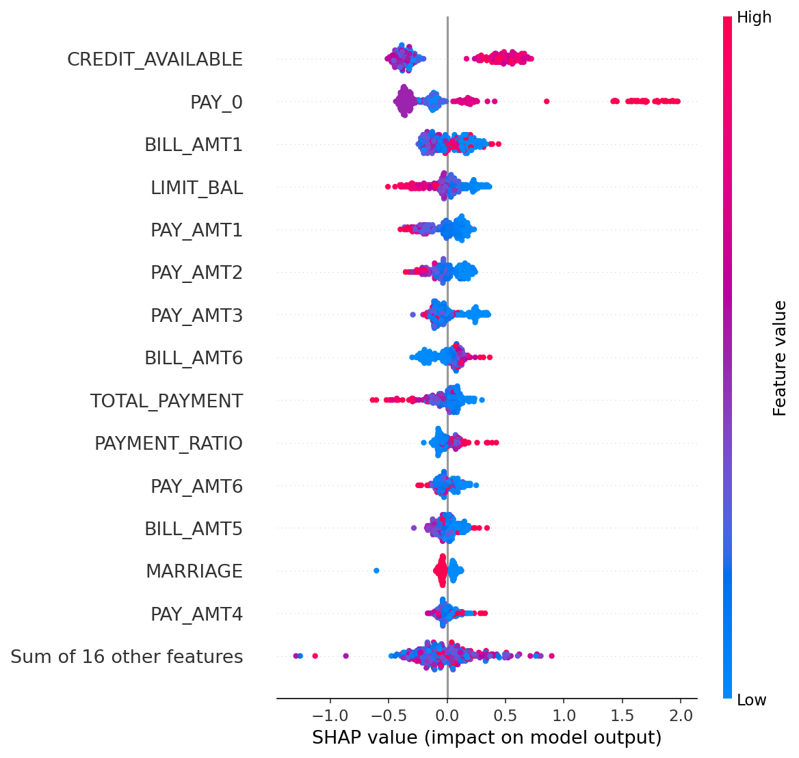

# Credit Risk Scoring Model

A machine learning system that predicts the probability of credit card default and converts it into an actionable credit score (300–900 scale). Banks, NBFCs, and fintechs use models like this to automate lending decisions — approving, rejecting, or flagging applications for manual review.

## Overview

This project implements an end-to-end credit risk scoring pipeline using the [UCI Credit Card Default dataset](https://archive.ics.uci.edu/ml/datasets/default+of+credit+card+clients) (30,000 clients, 24 features). The workflow covers data preprocessing, feature engineering, model training, score calibration, risk banding, model interpretability via SHAP, and an interactive Streamlit dashboard for live scoring.

**Target variable:** `default` — binary flag (1 = default next month, 0 = no default)

## Pipeline Architecture


```
Data Ingestion → Preprocessing → Feature Engineering → Model Training
       → Validation → Score Calibration & Banding → Decision Engine → Dashboard
```

| Stage | What it does |
|---|---|
| **Data Ingestion** | Load UCI Credit Card dataset from `data/raw/` |
| **Preprocessing** | Handle missing values, scale numeric features with `StandardScaler` |
| **Feature Engineering** | Derive utilization, bill totals, and delinquency signals |
| **Model Training** | Train Logistic Regression, Random Forest, and XGBoost classifiers |
| **Validation** | Evaluate with ROC-AUC, classification report, confusion matrix |
| **Score Calibration** | Map default probability → credit score (300–900) |
| **Risk Banding** | Assign risk categories for decision routing |
| **Interpretability** | Feature importance and SHAP summary plots |
| **Deployment** | Interactive Streamlit dashboard with live scoring |

## Model Results

Four models were trained and compared on an 80/20 train-test split:

| Model | ROC-AUC |
|---|---|
| **XGBoost** | **0.7789** |
| Random Forest | 0.7778 |
| Logistic Regression + SMOTE | 0.7117 |
| Logistic Regression | 0.7084 |

XGBoost achieved the best discriminatory power and was selected as the production model. Class imbalance was addressed using SMOTE for the logistic regression variant.

## Feature Engineering

The production XGBoost model uses 23 raw features plus 4 engineered features:

| Feature | Description |
|---|---|
| `TOTAL_BILL` | Sum of bill amounts across 6 months |
| `TOTAL_PAYMENT` | Sum of payment amounts across 6 months |
| `UTILIZATION_RATIO` | Credit utilization (`TOTAL_BILL / LIMIT_BAL`) |
| `AVG_DELAY` | Average repayment delay across 6 months (`PAY_0`–`PAY_6`) |

## Score Calibration & Risk Bands

Default probabilities from XGBoost are converted to a credit score:

```
Credit Score = 850 − (default_probability × 550)
```

| Score Range | Risk Category | Decision |
|---|---|---|
| ≥ 800 | Very Low Risk | Auto-approve |
| 700 – 799 | Low Risk | Auto-approve |
| 600 – 699 | Medium Risk | Manual review |
| < 600 | High Risk | Auto-decline |

Thresholds are adjustable in the dashboard sidebar for interactive what-if analysis.

## Visualizations & Model Interpretability

### Feature Importance (XGBoost)

`PAY_0` (most recent repayment status) is the dominant predictor, followed by `AVG_DELAY` and historical payment behavior (`PAY_2`, `PAY_3`).



### SHAP Summary

SHAP values show how each feature pushes predictions toward default or non-default. Red (high feature value) and blue (low feature value) indicate direction and magnitude of impact.



### Credit Score Distribution

Calibrated scores are left-skewed — most applicants cluster in the 750–850 range, with a smaller high-risk tail below 600.


## Interactive Dashboard

Launch the Streamlit app for real-time credit scoring and portfolio analysis:

```bash
streamlit run app/streamlit_app.py
```

| Page | Description |
|---|---|
| **Live Scoring** | Instant score updates as you adjust sliders — Plotly gauge, bill vs payment chart, scenario save |
| **What-If Analysis** | Sensitivity curves for key variables (`PAY_0`, `LIMIT_BAL`, `AGE`, etc.) |
| **Compare Scenarios** | Side-by-side comparison of two saved applicant profiles |
| **Batch Scoring** | Upload CSV or score sample data with interactive filters and download |
| **Portfolio Analytics** | Risk band drill-down, utilization scatter, default rate by band |
| **Model Insights** | ROC-AUC comparison, decision funnel simulator, training plots |

**Sidebar controls:** adjustable auto-approve and manual-review score thresholds that update decisions across all pages in real time.

## Project Structure

```
Credit-Risk-Scoring-Model/
├── app/
│   ├── streamlit_app.py             # Interactive dashboard
│   └── scoring.py                   # Model loading, feature engineering, scoring API
├── data/
│   └── raw/
│       └── UCI_Credit_Card.csv      # Source dataset
├── notebooks/
│   └── Credit_Risk_Model.ipynb      # End-to-end training notebook
├── models/
│   ├── credit_risk_model.pkl        # Trained XGBoost model
│   └── scaler.pkl                   # Fitted StandardScaler (for LR models)
├── images/                          # README documentation images
│   ├── pipeline_architecture.png
│   ├── feature_importance.png
│   ├── shap_summary.png
│   └── credit_score_distribution.png
├── reports/                         # Generated during notebook training
│   ├── pipeline_architecture.png
│   ├── feature_importance.png
│   ├── shap_summary.png
│   └── credit_score_distribution.png
├── requirements.txt
└── README.md
```

## Getting Started

### 1. Clone and set up environment

```bash
git clone <repository-url>
cd Credit-Risk-Scoring-Model

python -m venv venv
source venv/bin/activate        # Windows: venv\Scripts\activate
pip install -r requirements.txt
```

### 2. Run the training notebook

```bash
jupyter notebook notebooks/Credit_Risk_Model.ipynb
```

The notebook will:
- Load and preprocess the dataset
- Engineer features and train all models
- Calibrate scores and assign risk bands
- Save model artifacts to `models/` and plots to `reports/`

### 3. Launch the dashboard

```bash
streamlit run app/streamlit_app.py
```

### 4. Score programmatically

```python
import sys
sys.path.insert(0, "app")

from scoring import load_model, build_feature_row, predict_with_thresholds

model = load_model()

applicant = {
    "LIMIT_BAL": 140_000,
    "SEX": 1,
    "EDUCATION": 2,
    "MARRIAGE": 2,
    "AGE": 35,
    "PAY_0": 0, "PAY_2": 0, "PAY_3": 0, "PAY_4": 0, "PAY_5": 0, "PAY_6": 0,
    "BILL_AMT1": 12_000, "BILL_AMT2": 11_500, "BILL_AMT3": 10_800,
    "BILL_AMT4": 9_200, "BILL_AMT5": 8_700, "BILL_AMT6": 7_900,
    "PAY_AMT1": 3_000, "PAY_AMT2": 2_800, "PAY_AMT3": 2_500,
    "PAY_AMT4": 2_200, "PAY_AMT5": 2_000, "PAY_AMT6": 1_800,
}

features = build_feature_row(applicant)
result = predict_with_thresholds(model, features, approve_min=700, review_min=600)

print(result)
# {'default_probability': 0.12, 'credit_score': 784, 'risk_category': 'Low Risk', 'decision': 'Auto-Approve'}
```

## Tech Stack

| Library | Purpose |
|---|---|
| pandas / numpy | Data manipulation |
| scikit-learn | Preprocessing, Logistic Regression, Random Forest |
| XGBoost | Production gradient boosting classifier |
| imbalanced-learn | SMOTE for class imbalance |
| SHAP | Model explainability |
| Streamlit | Interactive dashboard |
| Plotly | Interactive charts and gauges |
| matplotlib / seaborn | Static plots in notebook |
| Jupyter | Model development and training |

## Dataset

**Source:** [UCI ML Repository — Default of Credit Card Clients](https://archive.ics.uci.edu/ml/datasets/default+of+credit+card+clients)

- **Records:** 30,000
- **Features:** 23 input variables + 1 target
- **Default rate:** ~22%
- **Key raw features:** `LIMIT_BAL`, `PAY_0`–`PAY_6` (repayment status), `BILL_AMT1`–`BILL_AMT6`, `PAY_AMT1`–`PAY_AMT6`, demographics (`SEX`, `EDUCATION`, `MARRIAGE`, `AGE`)

## Future Work

- [ ] FastAPI REST endpoint for real-time scoring
- [x] Streamlit dashboard with live scoring and what-if analysis
- [ ] KS statistic, Gini coefficient, and PSI monitoring
- [ ] Out-of-time validation split
- [ ] Scheduled retraining on score drift alerts

## License

This project is for educational and portfolio purposes. The UCI dataset is publicly available for research use.
